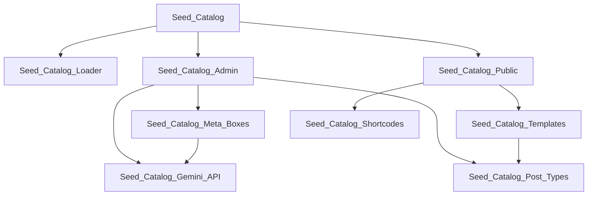

# Developer Guide

## Project Architecture

### Entry Points

1. **Plugin Initialization**
   ```php
   seed-catalog.php                # Plugin bootstrap and initialization
   uninstall.php                  # Clean uninstallation handling
   ```

2. **Configuration**
   ```
   composer.json                  # Composer dependencies and autoloading
   phpconfig.json                # PHP settings and configurations
   phpcs.xml                     # PHP CodeSniffer rules
   ```

### Core Components

#### Admin Module (`admin/`)
```
class-seed-catalog-admin.php     # Admin interface controller
css/seed-catalog-admin.css       # Admin styles
js/seed-catalog-admin.js         # Admin JavaScript functionality
```

Core admin functionality:
- Settings management
- Seed management interface
- AI feature controls
- Export/import tools

#### Public Module (`public/`)
```
class-seed-catalog-public.php    # Public interface controller
css/
  seed-catalog-public.css        # Main frontend styles
  seed-catalog-responsive.css    # Responsive design styles
js/
  seed-catalog-public.js         # Main frontend JavaScript
  seed-catalog-responsive.js     # Responsive behavior scripts
```

Frontend features:
- Grid display system
- Search functionality
- Filter implementation
- Responsive layouts

#### Core Classes (`includes/`)

1. **Plugin Foundation**
   ```php
   class-seed-catalog.php             # Main plugin orchestrator
   class-seed-catalog-loader.php      # Hook and filter registration
   ```

2. **Lifecycle Management**
   ```php
   class-seed-catalog-activator.php   # Installation and activation
   class-seed-catalog-deactivator.php # Deactivation handling
   class-seed-catalog-uninstaller.php # Complete cleanup
   class-seed-catalog-upgrader.php    # Version upgrades
   ```

3. **Feature Implementation**
   ```php
   class-seed-catalog-post-types.php  # Custom post type registration
   class-seed-catalog-meta-boxes.php  # Custom field management
   class-seed-catalog-shortcodes.php  # Shortcode system
   class-seed-catalog-templates.php   # Template loader
   ```

4. **Integration & Services**
   ```php
   class-seed-catalog-gemini-api.php  # Google Gemini AI integration
   class-seed-catalog-exporter.php    # Data export system
   ```

5. **Development Tools**
   ```php
   class-seed-catalog-diagnostic.php  # Debug and diagnostics
   class-seed-catalog-api-test.php    # API testing framework
   class-seed-catalog-api-test-util.php # Test utilities
   class-seed-catalog-minify.php      # Asset optimization
   ```

#### Template System (`templates/`)
```php
archive-seed.php                 # Seed catalog listing template
single-seed.php                 # Individual seed display
diagnostic.php                  # Debug information display
```

## Class Dependencies



## Hook System

### Action Hooks

1. **Lifecycle Hooks**
```php
do_action('seed_catalog_activated');
do_action('seed_catalog_deactivated');
do_action('seed_catalog_upgraded', $old_version, $new_version);
```

2. **Content Hooks**
```php
do_action('seed_catalog_before_seed_content');
do_action('seed_catalog_after_seed_content');
do_action('seed_catalog_before_seed_meta');
do_action('seed_catalog_after_seed_meta');
```

3. **Template Hooks**
```php
do_action('seed_catalog_before_template');
do_action('seed_catalog_after_template');
do_action('seed_catalog_before_archive');
do_action('seed_catalog_after_archive');
```

### Filter Hooks

1. **Content Filters**
```php
apply_filters('seed_catalog_seed_data', $data);
apply_filters('seed_catalog_meta_fields', $fields);
apply_filters('seed_catalog_template_path', $path);
```

2. **AI Integration Filters**
```php
apply_filters('seed_catalog_ai_confidence', $confidence);
apply_filters('seed_catalog_ai_suggestions', $suggestions);
```

3. **Display Filters**
```php
apply_filters('seed_catalog_grid_columns', $columns);
apply_filters('seed_catalog_items_per_page', $per_page);
```

## Asset Management

### Admin Assets
```php
wp_enqueue_style('seed-catalog-admin');
wp_enqueue_script('seed-catalog-admin');
```

### Public Assets
```php
wp_enqueue_style('seed-catalog-public');
wp_enqueue_style('seed-catalog-responsive');
wp_enqueue_script('seed-catalog-public');
wp_enqueue_script('seed-catalog-responsive');
```

## Database Schema

### Custom Post Type
```sql
wp_posts:
  - post_type = 'seed'
  - post_status = ['publish', 'draft', 'private']
```

### Meta Fields
```sql
wp_postmeta:
  - planting_depth
  - days_to_germination
  - days_to_maturity
  - sun_requirements
  - water_needs
  - usda_zones
```

## API Integration

### Gemini AI Integration
```php
class Seed_Catalog_Gemini_API {
    public function identify_plant($image);
    public function get_plant_details($name);
    public function suggest_growing_info($data);
}
```

## Template Hierarchy

1. Single Seed Display:
   - theme/seed-catalog/single-seed.php
   - theme/single-seed.php
   - plugin/templates/single-seed.php

2. Archive Display:
   - theme/seed-catalog/archive-seed.php
   - theme/archive-seed.php
   - plugin/templates/archive-seed.php

## Development Workflow

1. **Setup Development Environment**
```bash
composer install
npm install
```

2. **Run Tests**
```bash
composer test
composer phpcs
```

3. **Build Assets**
```bash
npm run build
npm run watch
```

## Extending the Plugin

### Custom Field Registration
```php
add_filter('seed_catalog_meta_fields', function($fields) {
    $fields['custom_field'] = [
        'type' => 'text',
        'label' => 'Custom Field',
        'default' => ''
    ];
    return $fields;
});
```

### Custom Template Tags
```php
function seed_catalog_get_custom_data($post_id = null) {
    // Implementation
}
```

### Custom Shortcodes
```php
add_filter('seed_catalog_shortcodes', function($shortcodes) {
    $shortcodes['custom_view'] = [
        'callback' => 'custom_view_callback',
        'defaults' => ['columns' => 3]
    ];
    return $shortcodes;
});
```

## Performance Optimization

1. **Asset Loading**
   - Conditional enqueuing
   - Minification
   - Cache headers

2. **Database Queries**
   - Custom tables for complex queries
   - Caching layer
   - Index optimization

3. **API Requests**
   - Request caching
   - Rate limiting
   - Batch processing

## Security Measures

1. **Input Validation**
   - Sanitization functions
   - Capability checks
   - Nonce verification

2. **API Security**
   - Key encryption
   - Rate limiting
   - Access logs

## Debugging

Enable debug mode in wp-config.php:
```php
define('WP_DEBUG', true);
define('WP_DEBUG_LOG', true);
define('SCRIPT_DEBUG', true);
```

Use diagnostic tools:
```php
Seed_Catalog_Diagnostic::log($message);
Seed_Catalog_Diagnostic::get_system_info();
```